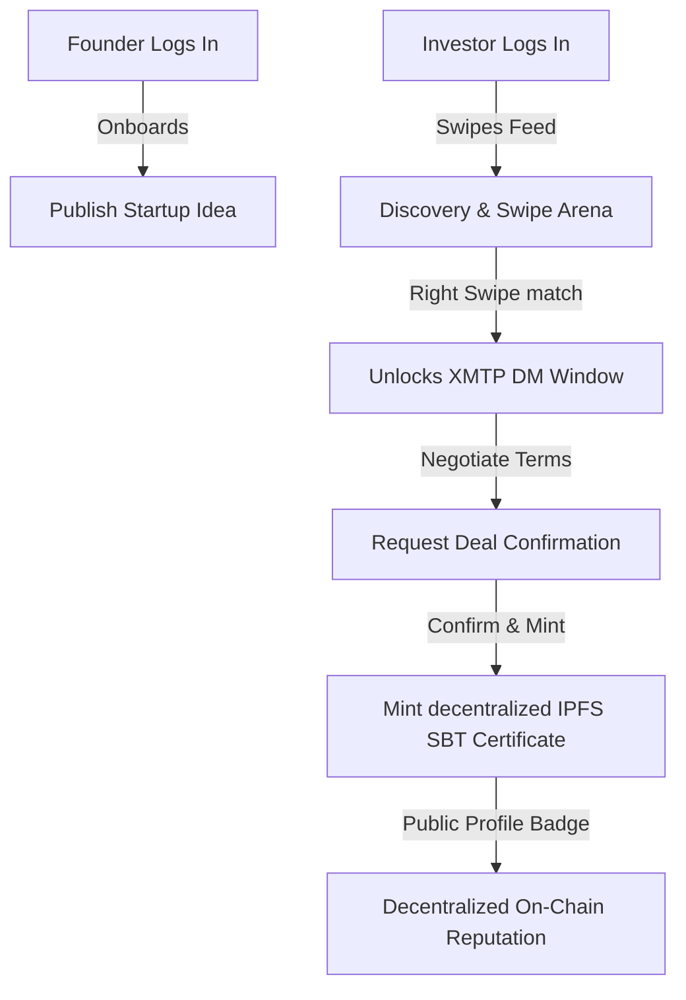

# 
⚡ NEXIS

  <h3>The On-Chain Matchmaking Engine for the Next-Gen Web3 Economy</h3>
  
Where world class founders meet conviction capital — in a single swipe.

  
  
  
  

---

## 📌 Executive Overview

**Nexis** is a luxury, high-fidelity Web3 decentralized application (dApp) designed to revolutionize start-up syndication and investor matchmaking. By combining a gamified Tinder-style discovery deck with robust cryptographic guardrails, Nexis eliminates the massive administrative friction, slow feedback loops, and trust issues that plague early-stage Web3 funding.

Built on the high-speed **Mantle Network**, powered by **Supabase Cloud**, and secured with gasless **XMTP MLS** (Message Layer Security) encryption, Nexis offers a sleek, intuitive console where institutional capital allocators and world-class builders discover, connect, and fund startups with zero latency.

---

## ⚠️ The Problem: Why Nexis Matters

The early-stage venture landscape is plagued by structural inefficiencies:
1. **Inefficient Sourcing**: Pitch decks sit stale in email inboxes. Founders spend months in repetitive outreach, while investors get spammed with uncurated, off-thesis ideas.
2. **Friction-Filled Conversations**: Standard messaging apps (Telegram, Discord) are filled with phishers, lacks structured context, and offer zero verification of active funding credentials.
3. **Lack of Verified Track Record**: Deal confirmations are buried in paper agreements. There is no public, decentralized ledger showing verified, completed transactions, making reputation building slow and opaque.

---

## 🛡️ The Solution: The Nexis Approach

Nexis transforms this pipeline into a decentralized, gamified, and highly secure ecosystem:

* **Interactive Swipe Arena**: Investors evaluate start-up decks as physical glass sheets using fluid 3D tilt controls (`rotateX`) and a floating console bar. 
* **Role-Gated Discovery Routing**: Builders manage their portfolio statistics and on-chain boosts, while investors discover pitches, avoiding layout clutter and keeping workflows strictly off-thesis.
* **Gasless E2E Encrypted Workspaces**: Matches automatically initialize secure XMTP DMs. Background sync loops preserve chat history and prevent memory leaks.
* **Decentralized Deal SBTs**: Closed deals are permanently certified on-chain. Nexis generates custom, glowing SVG vector certificates showing verified startup names, addresses, and dates, pinned to IPFS and minted as Soulbound Tokens (SBT).

---

## 💻 Tech Stack Overview

### Frontend & Visuals
* **React 18 + Vite**: Buttery smooth compiles and Hot Module Replacement (HMR).
* **TypeScript & TanStack Router**: Strongly-typed path generation, safe route parameters, and robust edit-mode gates.
* **Framer Motion**: Asymmetric animations, sliding active tabs, and responsive layout highlights.
* **GPU-Accelerated Composite Transforms**: Dynamic neon cursors utilizing translation matrices (`translate3d`) running at a locked 60 FPS.

### Storage & Telemetry
* **Supabase Cloud**: Instant database CRUD operations, real-time sentiment telemetries (views, likes, passes), and high-performance pipeline indexing.

### Web3 & Security
* **Privy React Auth**: Bridge Wagmi, injected browser wallets (MetaMask), and embedded Privy social/email logins seamlessly.
* **XMTP MLS Protocol**: Database-first local synchronization loops enabling real-time secure syncing without page reloads.
* **Mantle Network Sepolia**: On-chain verification, accelerator boost shop tier payments, and Soulbound Badge smart contract minting.
* **Pinata IPFS Integration**: Custom vector SVG certificates generated on-the-fly and uploaded decentrally to IPFS.

---

## 🚀 Step-by-Step Walkthrough: How to Use

### 1. Account Onboarding & Verification
* **Connect Wallet**: Sign in utilizing Privy social logins or Web3 hardware clients.
* **Establish Identity**: Pick your specialized role node (**Builder** or **Investor**). 
* **Verification Gate**: Builders submit a one-time Mantle network fee (1 MNT) to list pitches, establishing initial Sybil protection.

### 2. Startup Discovery (Investors Only)
* **Discovery Feed**: Swipe through active pitches. Swipe **Right** to Like, **Left** to Pass, and **Star** to bookmark for later.
* **Match Telemetry**: When an investor likes a pitch, Nexis cross-references active swipes in the database. If there is mutual interest, a **Match Connected** node is generated.

### 3. Encrypted Deal Negotiator
* **DM Pipeline**: Visit the E2E Chat dashboard. Matches automatically spawn secure XMTP chat rooms.
* **Real-time Syncing**: Exchange terms in a sleek workspace featuring WhatsApp/Tinder-style inbox switches and delivery indicators.

### 4. Soulbound Deal Settlement
* **Mint SBT**: When terms are finalized, the builder requests a digital certificate.
* **Decentralized Multi-Sig**: Once the investor clicks "Confirm", the dApp uploads a dynamic, custom SVG certificate to IPFS and mints a Soulbound Token (SBT) secured on the Mantle Sepolia network.
* **Public Showcase**: Verified deal badges with direct explorer verification links (`mantlescan.xyz`) are proudly displayed on showcase profiles!

---

## 💎 Elite Performance Tuning (Mobile Responsive UX)
* **Zero Scrolling Swipe Feed**: Spacings and card stack heights scale dynamically based on viewport height (`h-[44vh] min-h-[300px]`), ensuring swiping consoles are permanently visible on small mobile devices without scrolling.
* **Horizontal Scrolling Snap Decks**: Profile lists, gold certificates, bento cards, and dashboard portfolio widgets utilize horizontal snap layouts (`overflow-x-auto snap-x snap-mandatory`) for a seamless native-app feel.
* **Inline 3-Column Stats Cockpits**: Re-architected statistics rows to render as compact inline columns, scaling padding and typography elegantly while hiding lucide icons on narrow displays to prevent line wrapping.

---

  
💚 Made with passion by <b>Prashant Mishra</b>

  
<i>Building the Future of High-Conviction Capital Sourcing</i>

